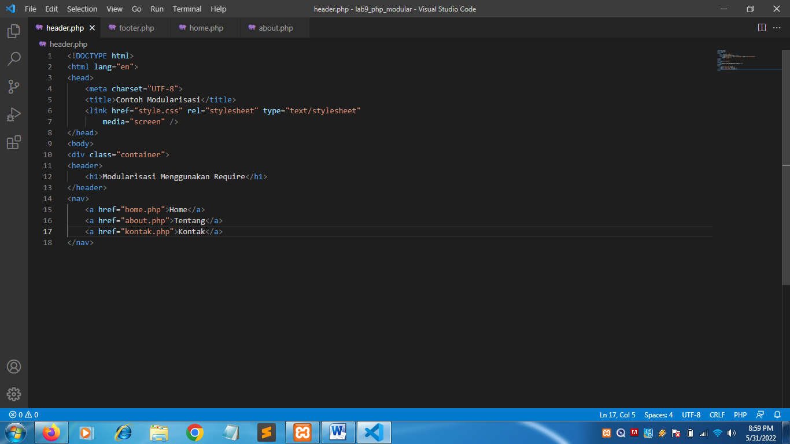
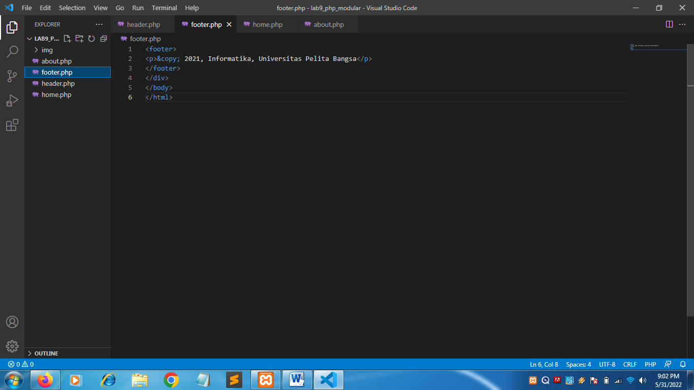
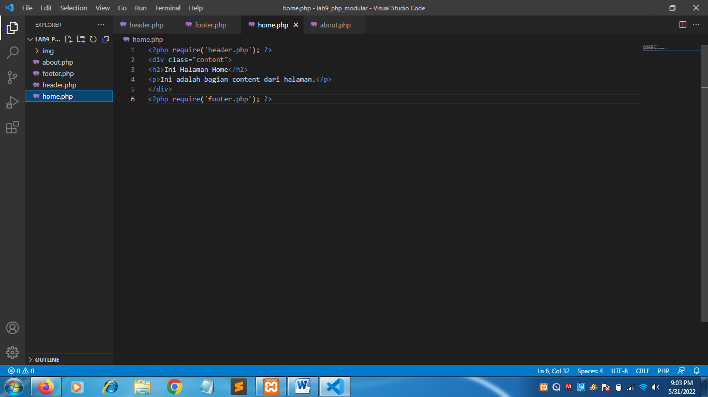
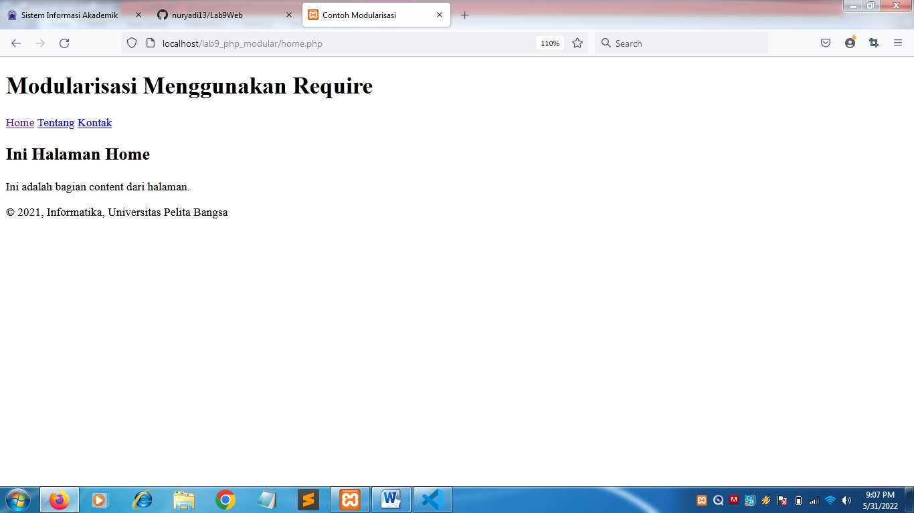
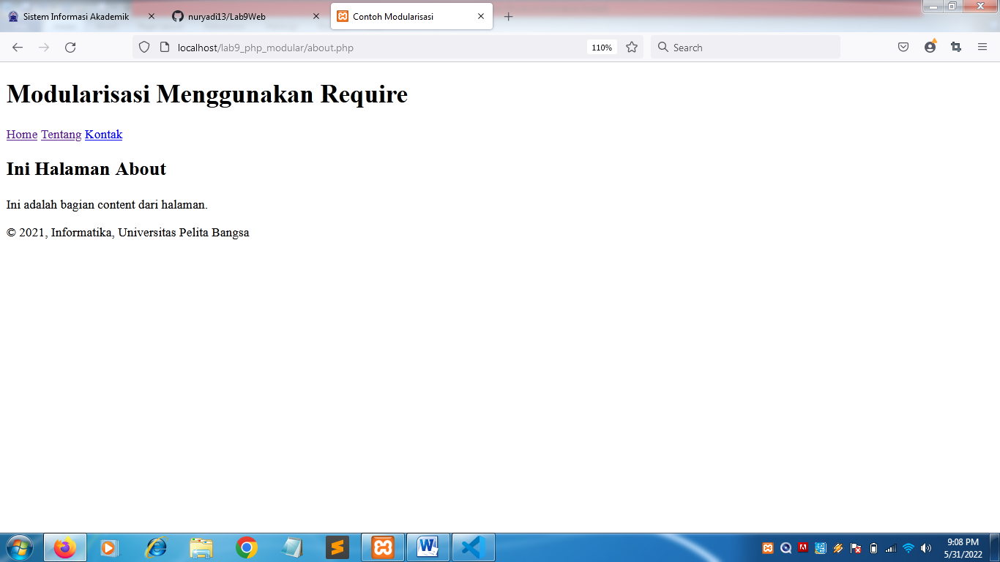
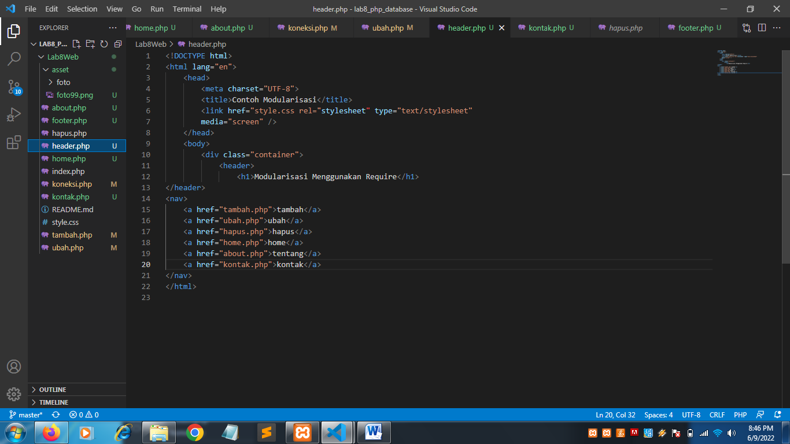
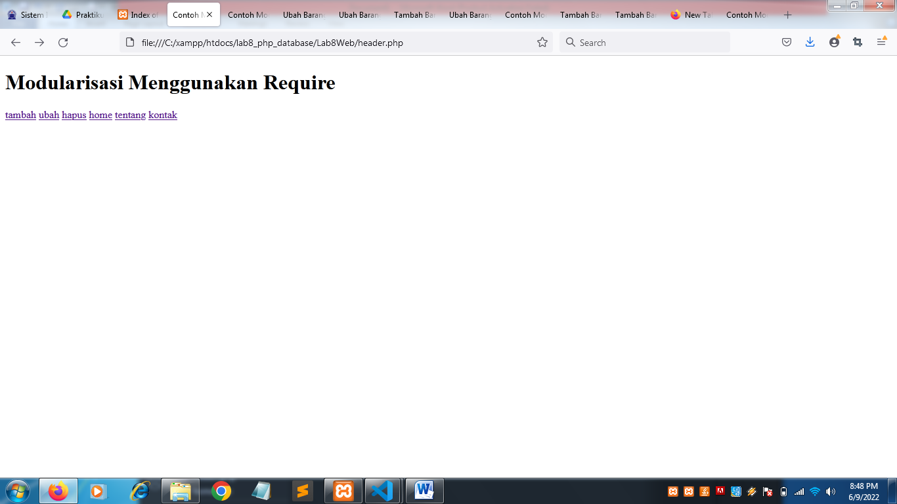
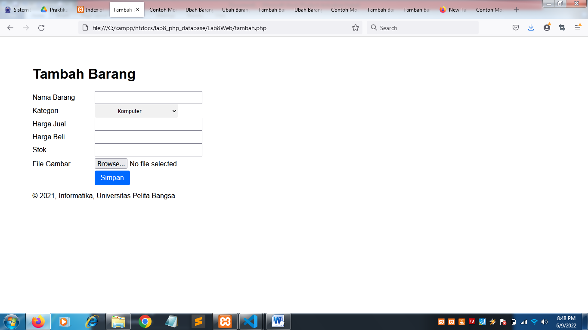

| Nama      | Nuryadi |
| ----------- | ----------- |
| NIM     | 312010621       |
| Kelas   | TI.20.A.1        |

## Langkah langkah praktikum 8

## 1. Buat file baru dengan nama header.php

## 2. Buat file baru dengan nama footer.php

## 3. Buat file baru dengan nama home.php

## 4. Buat file baru dengan nama about.php

## 5. Output

## Pertanyaan dan Tugas
Implementasikan konsep modularisasi pada kode program praktikum 8 tentang database, sehingga setiap halamannya memiliki template tampilan yang sama.
# berikut merupakan bentuk implementasi dari modularisasi pada praktikum 8

# output

