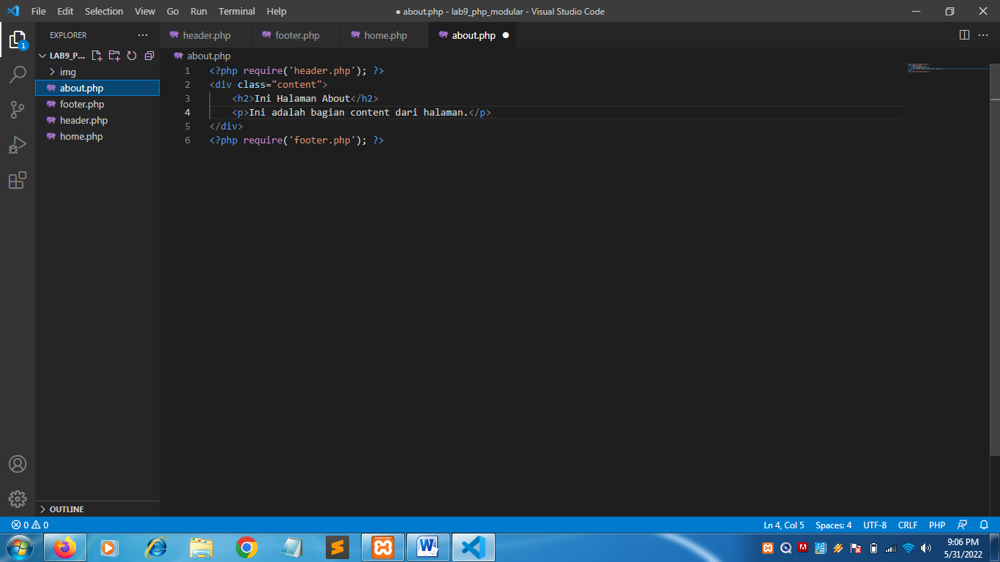

| Nama      | Nuryadi |
| ----------- | ----------- |
| NIM     | 312010621       |
| Kelas   | TI.20.A.1        |

## Langkah langkah praktikum 8

## 1. Buat file baru dengan nama header.php


## 2. Buat file baru dengan nama footer.php


## 3. Buat file baru dengan nama home.php


## 4. Buat file baru dengan nama about.php



## 5. Output


## Pertanyaan dan Tugas
Implementasikan konsep modularisasi pada kode program praktikum 8 tentang database, sehingga setiap halamannya memiliki template tampilan yang sama.

### berikut struktur direktori yang saya buat

```
lab8_php_database
├── config
│   ├── hapus.php
│   ├── koneksi.php
│   ├── tambah.php
│   └── ubah.php
├── layouts
│   ├── footer.php
│   ├── head-static.php
│   ├── header.php
│   ├── main.php
│   ├── tambah.php
│   └── ubah.php
├── static
│   ├── css
│   │   └── style.css
│   └── img
├── index.php
├── tambah.php
└── ubah.php
```

## config
dalam folder tersebut menyimpan file khusus php yang nanti akan dieksekusi 

koneksi.php


tambah.php


ubah.php


hapus.php


## layouts
Untuk menyimpan tampilan utama pada website, dan dibagi pada beberapa file

head-static.php


header.php


main.php


footer.php


## static
Untuk menyimpan file yg diperlukan, seperti css, js, gambar

style.css


## index.php, tambah.php, ubah.php
File utama dan berfungsi sebagai wadah untuk memanggil sub-file di beberapa direktori

index.php


tambah.php


ubah.php


## Output


